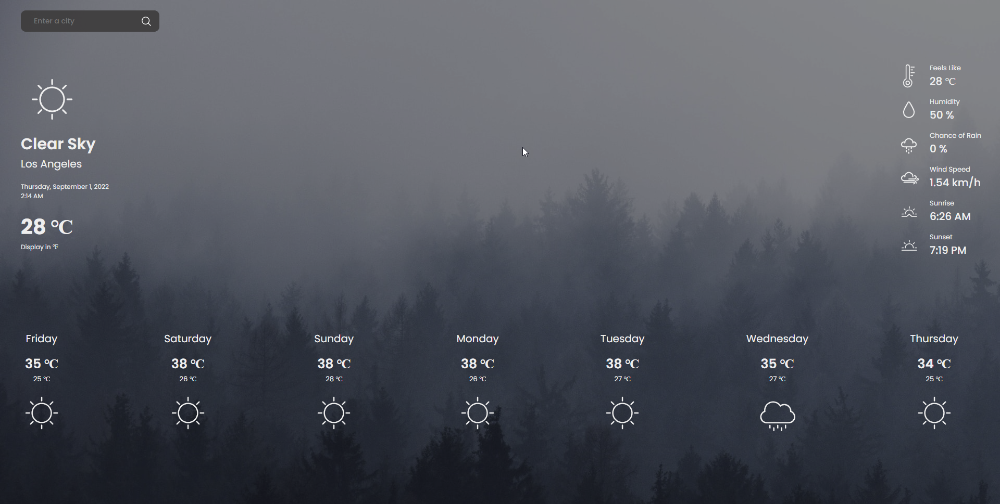

# weather-app

A weather app that shows weather properties for the selected city.
It shows current weather properties and 7 days daily forecast.

Webpack is used for bundling javascript files.
Open weather map API is used to retrieve weather data.

<a href="https://gunesozdogan.github.io/weather-app" name="demo">Live Demo</a>

Background Photo by <a href="https://unsplash.com/@pueblovista?utm_source=unsplash&utm_medium=referral&utm_content=creditCopyText">Paul Pastourmatzis</a> on <a href="https://unsplash.com/s/photos/weather?utm_source=unsplash&utm_medium=referral&utm_content=creditCopyText">Unsplash</a>
